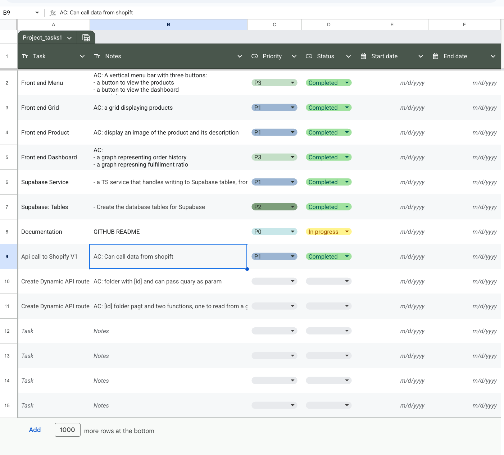
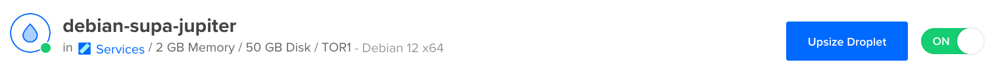
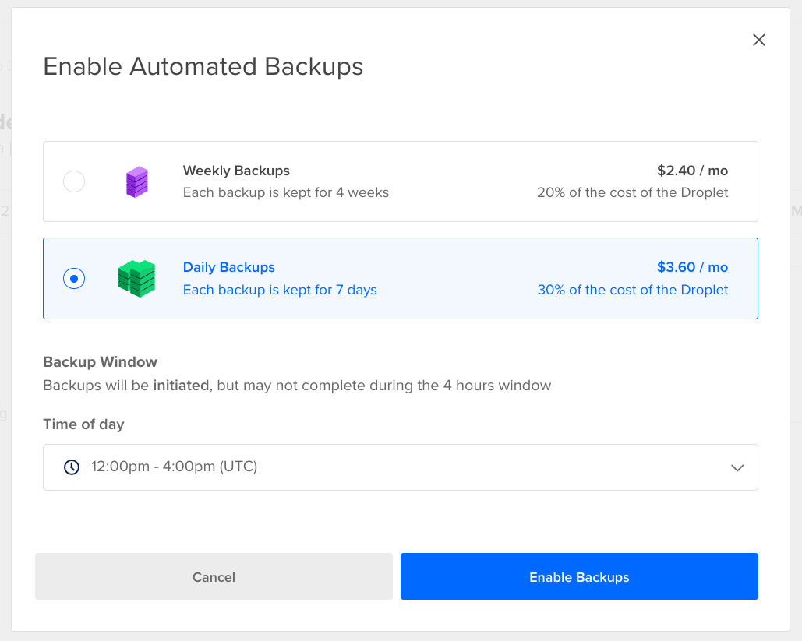

English Version Below

# Bienvenue à ma soumission pour LILA

- Déployé sur Vercel [ici](lila-demo-seven.vercel.app)

## Mon processus de travail

J'ai commencé par définir des user stories et critères d'acceptation - comme on le ferait dans JIRA  

### J'ai d'abord travaillé sur le back-end :

- J'ai déployé Supabase sur un Droplet DigitalOcean et l'ai hébergé sur un domaine : [https://jupiter-consulting.store](https://jupiter-consulting.store)
  - Pour le mot de passe si vous souhaitez le voir, merci de me contacter par email.

L'hébergement d'un serveur auto-géré est très intéressant car cela permet de contourner les limites de bande passante, nombre d'utilisateurs et autres restrictions arbitraires, tout en gardant le contrôle du déploiement.  

Il est également possible de configurer des sauvegardes :  

- J'ai développé les routes API pour récupérer les données de Shopify via GraphQL. J'ai utilisé le package `shopify-api-node`.
- Après avoir défini les données GraphQL nécessaires, j'ai créé les structures de tables dans Supabase.
- J'ai implémenté les routes API pour charger les données dans Supabase en évitant les doublons.
- J'ai travaillé sur la récupération des données depuis Supabase vers la console.

### Puis je me suis concentré sur le front-end :

- La barre de navigation latérale en premier.
- Ensuite la page produits et les fiches produit individuelles.
- Enfin, j'ai construit la grille pour les graphiques - j'ai (élégamment) obtenu l'aide de l'IA pour cette partie, en la guidant pour créer les visualisations souhaitées.

---

# Welcome to my submission for LILA

- Deployed on Vercel [here](lila-demo-seven.vercel.app)

## How I worked

I started by setting some stories and acceptance criteria - like one would in JIRA

### I worked on the back-end first:

- I deployed Supabase to a DigitalOcean Droplet and hosted it on a domain: https://jupiter-consulting.store
  - For the password if you wish to see, please contact me at my email.

Deploying a self-hosted server is really cool because it allows you to bypass bandwith, user number, and other arbitrary limits, giving you control over the deployment.

As well it is possible to set up backups:

- I worked on the API routes for getting data from GraphQL from Shopify. For this I use the `shopify-api-node` pacakge
- After settling on my desired grapql data, I created the table definitions in Supabase.
- I worked on the API routes for loading the data from graphql into Supabase, avoiding duplicates
- I worked on retrieving the data from Supabase into the console.

### Then I turned to the front end:

- Navigation Side Bar came first
- Then Products page and individual product
- Finally, I built the grid that would accept some chart items - but (gracefully) got some help from AI for this part, guiding it to create the graphs I want. This generated some errors, I have disabled ESlint for the deployment, but the charts page should be redone.
